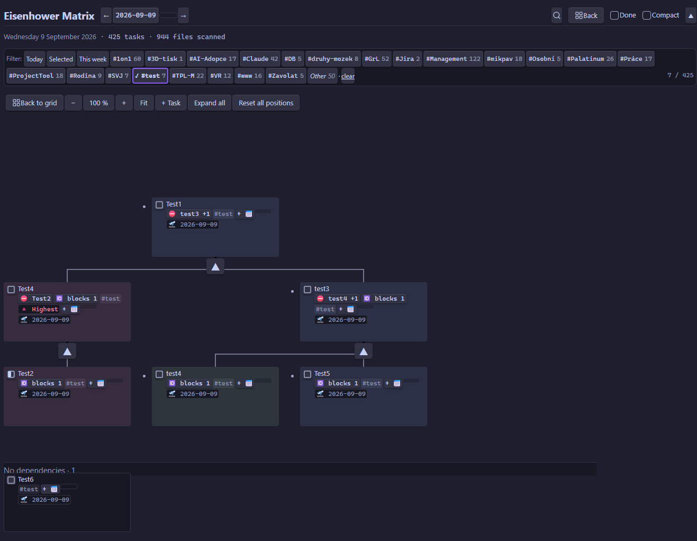

[English](README.md) · **Čeština**

# 4D Eisenhower Matrix — Obsidian plugin

Vizualizace tasků napříč celým vault-em v **6-polové Eisenhower matici** (DO IMMEDIATELY / DO REDUCED QUALITY / DELEGATE WITH PRIORITY / DELEGATE / SCHEDULE / DEFER / OPEN) + Kanban view. Čte a zapisuje [Obsidian Tasks](https://publish.obsidian.md/tasks/Introduction) syntaxi — `#tagy`, `📅 due`, `🛫 start`, `✅ done`, priority.

> Ranní dashboard pro rozhodnutí *co dělat teď*: ráno otevřu, vidím tasky rozdělené podle priority, odškrtnu hotové, případně přidám nové. Source-of-truth zůstávají MD soubory, plugin je jen vizuální vrstva nad nimi.




<p align="center"></p>

## Co to umí

| Funkce | Co dělá |
|--------|---------|
| **6-polová matice** | DO IMMEDIATELY / DO REDUCED QUALITY / DELEGATE WITH PRIORITY / DELEGATE / SCHEDULE / DEFER + záchytný **OPEN**. Kvadrant určuje první `#tag` za checkboxem (`#DO_IMMEDIATELY`, `#DO_REDUCED`, `#DELEGATE_PRIORITY`, `#DELEGATE`, `#SCHEDULE`, `#DEFER`); cokoli jiného spadne do OPEN. |
| **Kanban zobrazení** | Rozbalí libovolný kvadrant na celou šířku se sloupci **To-do · In progress · Scheduled · Done**. Na desktopu drag karet mezi sloupci mění stav, na jiný kvadrant je přesune, nebo task rovnou přidáš do sloupce. Na mobilu/tabletu board scrolluje vodorovně a stav měníš přes menu karty (*Mark as…*). |
| **Graf závislostí** | Ukazuje cíle nad jejich blokátory v pravoúhlé mřížce a úkoly bez vazeb v odděleném pásmu. Větve lze sbalit, graf zoomovat a na desktopu karty ručně rozmístit; první ruční posun přidá `🆔`, souřadnice zůstávají v `data.json`. Mobil nabízí čtení, navigaci, menu a zakládání bez dragu. |
| **Cross-vault agregace** | Sbírá tasky ze **všech `.md` souborů** ve vaultu (Dataview-like), ne jen z dnešní daily note — jeden board nad celým druhým mozkem. |
| **6 stavů tasku** | Things-style `[ ]` to-do · `[/]` in progress · `[x]` done · `[-]` canceled · `[>]` forwarded · `[<]` scheduling. Každá karta má status box; libovolný stav nastavíš pravým klikem → *Mark as…*. |
| **Plné CRUD** | Přidání (text + tagy + due date + priorita), inline editace, odškrtnutí, přesun mezi kvadranty — vše se zapíše přímo do Markdownu. |
| **Priorita** | Obsidian Tasks konvence: 🔺 highest · ⏫ high · 🔼 medium · 🔽 low · ⏬ lowest. Zároveň páka na řazení — zvýším prioritu a task vyskočí nahoru. |
| **Due / start / done data** | Čte a zapisuje `📅 due`, `🛫 start`, `✅ done`. Overdue tasky jsou zvýrazněné a plavou nahoru ve svém kvadrantu. |
| **Markdown v textu tasku** | Inline **tučné**, *kurzíva*, `kód`, ~~přeškrtnuté~~; úvodní `#`…`######` vykreslí task jako nadpis. |
| **Klikatelné odkazy** | `[[wikilinky]]` (i s `#nadpisem` / `\|aliasem`) a `[text](url)` v názvu tasku jsou aktivní — klikem otevřeš poznámku (rozlišeno vůči souboru tasku) nebo URL; Ctrl/Cmd-klik otevře v novém panelu. Klik nespustí drag ani editaci. Externě se otevřou jen `https:`/`http:`/`mailto:` URL — jiná schémata zůstanou plain text. |
| **Tag autocomplete** | Při psaní napovídá existující tagy z vault-u, ať netvoříš skoro-duplicity. |
| **Filtr podle tagu** | Context-tag chipy ve filter baru (multi-select, OR logika) + virtuální „Other" chip pro tasky bez tagu. |
| **Rychlé filtry podle due date** | Tlačítka **Today** (overdue + due dnes), **Selected** (due přesně na datum vybrané v hlavičce) a **This week** (overdue + 7 dní dopředu) na začátku filter baru, opticky odlišená oranžovou. |
| **Datum navigace** | ← / → / kalendář / Dnes + den-cutoff banner po půlnoci s nabídkou skoku na dnešek. |
| **Undo grace period** | 3sekundové okno se zeleným odpočtem po odškrtnutí/zrušení tasku — klik znovu = vrátit. |
| **Kompaktní režim** | Přepínač v hlavičce zmenší každou kartu na dva řádky (text + priorita/due date) pro hustší přehled. |
| **Zobrazit / skrýt hotové** | Přepínač „Done" odhalí nebo skryje hotové tasky (`[x]` + `[-]`); počítadlo tasků se přizpůsobí. |
| **Hledání tasků** | Lupa vlevo od „Collapse all" rozbalí vyhledávací pole a prohledá tasky zobrazeného dne (text, tagy, jméno zdrojového souboru) bez ohledu na velikost písmen a diakritiku. Pohled na každou shodu přejede, sbalený kvadrant kvůli tomu rozbalí a Kanban přepne na správný kvadrant; shodu, kterou by aktivní filtry schovaly, ukáže i tak. Enter / Shift+Enter (nebo tlačítka ▲ ▼) chodí po shodách, Esc pole zavře a poslední nález nechá vidět. |
| **Sbalitelné UI** | Sbal jednotlivé kvadranty nebo celou hlavičku pro víc místa — užitečné na mobilu. |
| **Deterministické řazení** | V kvadrantu: overdue → priorita → due date → abecedně. Žádné nechtěné přeskupení dragem. |
| **Daily note integrace** | Nové tasky jdou pod **konfigurovatelný nadpis sekce**; pokud dnešní daily note chybí, vytvoří se automaticky podle tvého core „Daily notes" template (`{{date}}`, `{{title}}`, `{{time}}`). |
| **Vyloučené složky** | Odkloní matici od šablon, archivů nebo čehokoli, co nechceš skenovat. |
| **Závislosti tasků** | Čte vazby Obsidian Tasks `🆔` / `⛔`, řadí předpoklady první a umožňuje editovat Before this / After this podle názvu tasku. |
| **Desktop i mobil** | Funguje na desktopu i Androidu (`isDesktopOnly: false`); responzivní layout s ovládáním pro dotyk. |
| **Theme-aware** | Postavené čistě na Obsidian CSS proměnných — přizpůsobí se světlému/tmavému theme i accent barvě. |

V grafovém režimu se **Hide blocked tasks** ignoruje, protože blokátory tvoří jeho strukturu. Hotové blokátory řídí existující přepínač **Done**. Ruční pozice patří konkrétnímu vaultu a nepřenášejí se. Když založení selže až po vytvoření daily note, prázdná poznámka může zůstat.

## Instalace

**Settings → Community plugins → Browse → vyhledej „4D Eisenhower Matrix" → Install → Enable.**

Pak otevři přes ribbon ikonu (mřížka v levém panelu) nebo command palette → *Open matrix*.

## Syntaxe tasků

Plugin čte/zapisuje běžnou Obsidian Tasks syntaxi:

```markdown
- [ ] #DO_IMMEDIATELY #Osobní ⏫ 📅 2026-05-20 🛫 2026-05-15 Důležitý call s Alicí
- [x] #SCHEDULE Dlouhodobé plánování ✅ 2026-05-10
- [ ] #DO Legacy tag — pořád se mapuje na DO IMMEDIATELY
- [ ] task bez quadrant tagu  ← spadne do OPEN kvadrantu
```

Kvadrantové tagy (první token po `- [ ]`):

| Tag | Kvadrant | Význam |
|-----|----------|--------|
| `#DO_IMMEDIATELY` | 🔴 DO IMMEDIATELY | Důležité + Urgentní |
| `#DO_REDUCED` | 🟠 DO REDUCED QUALITY | Nedůležité + Urgentní |
| `#DELEGATE_PRIORITY` | 🟣 DELEGATE WITH PRIORITY | Důležité + Urgentní + Nelze udělat |
| `#DELEGATE` | 🟢 DELEGATE | Nedůležité + Urgentní |
| `#SCHEDULE` | 🔵 SCHEDULE | Neurgentní + Důležité |
| `#DEFER` | 🟡 DEFER | Neurgentní + Nedůležité |
| *(jiný / žádný)* | ⚫ OPEN | Bez quadrant tagu |

Legacy tagy `#DO` → DO IMMEDIATELY, `#DECIDE` → SCHEDULE a `#DELETE` → DEFER jsou kvůli zpětné kompatibilitě stále rozpoznávané.

Priorita ([Obsidian Tasks konvence](https://publish.obsidian.md/tasks/Getting+Started/Priorities)):

| Emoji | Úroveň |
|-------|--------|
| 🔺 | Nejvyšší |
| ⏫ | Vysoká |
| 🔼 | Střední |
| 🔽 | Nízká |
| ⏬ | Nejnižší |

## Ovládání

| Akce | Jak |
|------|-----|
| Odškrtnout task | Klik na checkbox · 3 s grace period (klik znovu = vrátit) |
| Přidat task | Klik `+` v headeru kvadrantu → text + #tagy + 📅 + ⏫ → Enter |
| Editovat task | **Desktop:** dvojklik na kartu. **Mobil:** long-press / dvojklep → menu → „Edit" |
| Změnit termín samostatně | Klik na 📅 badge na kartě |
| Přesun mezi kvadranty | **Desktop:** drag karty na cílový kvadrant. **Mobil:** long-press / dvojklep → menu → „Move to…" |
| Otevřít source soubor | **Desktop:** pravý klik na kartu. **Mobil:** long-press / dvojklep. → menu (current pane / nová záložka / split / okno) — kurzor přistane na řádku tasku |
| Filtr podle tagu | Klik na chip ve filter baru (multi-select OR) |
| Rychlý filtr podle due date | Tlačítka **Today** (overdue + due dnes) / **Selected** (due na datum vybrané v hlavičce) / **This week** (overdue + 7 dní) na začátku filter baru |
| Předchozí / další den | Šipky ← → v headeru, kalendář, nebo „Dnes" |
| Sbalit kvadrant | Klik na šipku ▼/▶ vedle názvu kvadrantu |
| Sbalit celou hlavičku | ▲ vpravo nahoře (užitečné na mobilu) |
| Hledat tasky | Lupa vlevo od „Collapse all" → piš · Enter / ▼ další shoda · Shift+Enter / ▲ předchozí · Esc / ✕ zavřít (poslední nález zůstane vidět) |
| Zobrazit hotové tasky | Toggle „Done" v headeru |
| Kompaktní zobrazení | Přepínač „Compact" v headeru — 2řádkové karty |
| Změnit stav tasku | Pravý klik na kartu (nebo na status box) → *Mark as…* |
| Kanban zobrazení | Klik na kanban ikonu v hlavičce kvadrantu → status sloupce; další klik zpět na mřížku. Na mobilu/tabletu sloupce scrollují vodorovně; stav karty změníš přes její menu (*Mark as…*) |

### Pořadí v kvadrantu

Deterministické, nelze ručně přeskupit:
1. **Overdue** (📅 < dnes) — nahoře
2. **Priorita desc** — 🔺 → ⏫ → 🔼 → 🔽 → ⏬ → bez priority
3. **Due date asc** — nejbližší termín první
4. **Alfabeticky** podle textu

Manuální páka přeskupování je **priorita** — nastav ji a task se vyhoupne nahoru.

### Závislosti tasků

Matice čte `🆔 id` a `⛔ id1,id2`. Blokované karty jsou ztlumené a odkazují na předpoklady; tasky, které blokují jiné, odkazují zpět. Vazby lze upravit inline přes **Before this** a **After this**. Předpoklady se řadí první v témže kvadrantu; vazba mezi kvadranty stále označí task jako blokovaný, ale pořadí neovlivní.

Chybějící ID a cykly se zobrazí jako varování. Blokovaný task lze po potvrzení dokončit a dokončení předpokladu oznámí počet odblokovaných tasků. Tasky ve vyloučených složkách se neindexují, takže vazby na ně vypadají jako neznámé a neblokují ani neovlivňují řazení.

Parser zachovává jen jmenovitě podporovaná pole Tasks (`⏳`, `➕`, `🔁`, `🏁`, `❌`); případné nové pole Tasks je nutné do tohoto seznamu ručně doplnit. Cokoli jiného zůstává v názvu tasku, kam to patří.

**Známé meze.** Metadata Tasks se čekají na konci řádku, přesně jak je zapisuje samotný plugin Tasks. Text napsaný *za* pole jako `⏳` nebo `🔁` se přečte jako hodnota toho pole a z názvu karty zmizí; `⛔` použité dekorativně si vezme následující slovo jako id závislosti. Dekorativní emoji piš před metadata, ne za ně.

## Nastavení

`Settings → 4D Eisenhower Matrix`:

- **Daily folder** — kam ukládat nové daily notes. Prázdné = respektuj core plugin „Daily notes" config. Override = vlastní cesta (s folder suggesterem).
- **Daily section heading** — nadpis v daily note, pod který se čtou a přidávají dnešní tasky. Výchozí: `# Today`. Nastav podle toho, co používáš (např. `# Dnes`, `## Úkoly`).
- **Vyloučené složky** — tasky z těchto složek se ignorují. Výchozí: žádné — vyloučené složky si nastav sám. Na Obsidianu 1.13+ je to nativní seznam (`+` otevře výběr složky, každý řádek má mazací tlačítko), na starších verzích UI s + / × a folder suggesterem.
- **Warn when completing a blocked task** — před zavřením blokovaného tasku zobrazí potvrzení. Výchozí: zapnuto.
- **Respect task dependencies when sorting** — uvnitř kvadrantu řadí předpoklady před závislé tasky. Výchozí: zapnuto.
- **Hide blocked tasks** — skryje právě blokované tasky z matice; pokud je blokovaný i blokátor, mohou zmizet obě karty a matice neukáže, na co řetěz čeká. Výchozí: vypnuto.

Na Obsidianu 1.13 a novějším se nastavení navíc najde přes vyhledávací pole nahoře v okně Settings.

## Daily note integrace

Plugin hledá v daily souboru konfigurovatelný nadpis sekce (nastavuje se v **Settings → Daily section heading**, výchozí `# Today`). Nové tasky vkládá pod tuto sekci.

Pokud daily note pro daný den neexistuje a přidáš první task, plugin ji **vytvoří automaticky**:
1. Pokud má core plugin „Daily notes" nastavený **template**, použije ho (s expanzí `{{date}}`, `{{title}}`, `{{time}}`)
2. Jinak fallback na minimální scaffold (frontmatter + nastavený nadpis sekce)

## Mobile

Funguje na Androidu (`isDesktopOnly: false`; iOS nezkoušeno, ale mělo by fungovat).

- **Long-press nebo dvojklep** na kartu → context menu (Edit · Open file · **Move to…**)
- **Přesun mezi kvadranty** se na mobilu dělá přes menu („Přesunout → SCHEDULE" atd.). Touch-drag je v Obsidian mobile webview nespolehlivý, proto menu — dva klepy, deterministické.
- **Sbalená hlavička** (▲ tlačítko) — uvolní vertikální místo pro matici

## Roadmap

- [ ] Quick-add task přes Command Palette (bez otvírání view)
- [ ] Klávesové zkratky uvnitř view (J/K navigace, X toggle, N nový task)
- [ ] Plný moment.js syntax v daily templatech (zatím jen `{{date}}`/`{{title}}`/`{{time}}`)

Něco postrádáš? [Issue na GitHubu](https://github.com/krcaljaroslav/4D-eisenhower-matrix/issues).

## Známé limity

- Manuální pořadí napříč soubory (jeden task v daily, jiný v projektu) není podporováno — sort je deterministický.

## Bugs / přispívání

[Issues](https://github.com/krcaljaroslav/4D-eisenhower-matrix/issues) · Pull requesty vítané.

## Changelog

**1.0.37** — Úklid nálezů z kontroly pluginu od Obsidianu, ovládání se nemění. Obě potvrzovací hlášky (reset pozic v grafu, dokončení blokovaného tasku) používají místo prohlížečového `confirm()` Obsidian modal - ten se v popout okně otvíral nad špatným oknem a na mobilu mohl být potlačený úplně; ze stejného důvodu plánuje graf animační snímky přes `window`. Zmizela obě pravidla s `!important`: editovaná karta v grafu si pevnou výšku zahazuje už u zdroje a mobilní pravidlo skrývající porty vyhrálo specificitou. `minAppVersion` se posouvá na **1.8.7**, což je verze, ve které vzniklo použité `Notice` API.

**1.0.36** — Přidán graf závislostí vzniklý ve vývojovém cyklu 1.0.33, nyní s funkčním zakládáním tasků a našeptáváním tagů, ovládáním jednotlivých větví, sdíleným odpočtem dokončení, centrovaným resetem a zoomem, posuvníky a tažením plátna, konzistentním tlačítkem Back a širšími compact kartami bez nadbytečných textových popisků vazeb.

**1.0.32** — Oprava neviditelného výběru hledání na prošlých taskech: aktuální shodu nově značí accentový outline kreslený vně karty, takže je vidět i přes červený rámeček overdue (a přes ztlumené blokované karty), místo aby mu podlehl. Červený rámeček zůstává, takže prošlá shoda dál vypadá jako prošlá.

**1.0.31** — Přibylo **hledání tasků**: lupa vlevo od „Collapse all" rozbalí vyhledávací pole, které prohledá tasky zobrazeného dne — text tasku, kontextové tagy a jméno zdrojového souboru — bez ohledu na velikost písmen a diakritiku („zaloha" najde „Zálohovat"). Pohled na každou shodu přejede a zvýrazní ji; sbalený kvadrant se kvůli tomu sám rozbalí a Kanban přepne kvadrant, takže se shoda nemá kam schovat, a shodu, kterou by aktivní filtry tagů / due / „Done" skryly, plugin ukáže i tak. Enter a Shift+Enter (nebo tlačítka ▲ ▼ kvůli mobilu) procházejí shody s počítadlem `3/12`, Esc nebo ✕ pole zavře a poslední nález nechá vidět.

**1.0.30** — Přidány závislosti Obsidian Tasks (`🆔` / `⛔`): řazení podle vazeb, badge a navigace blokátorů, inline editace Before this / After this, varování při dokončení, nastavení filtru a bezpečné zachování metadat při editaci.

**1.0.29** — Interní oprava bez viditelné změny: dvě API Obsidianu 1.13, která používá nová karta nastavení (`SettingTab.update()`, `ButtonComponent.setDestructive()`), jsou nově za guardem `requireApiVersion('1.13.0')`. Volala se odjakživa jen na 1.13+, ale statická kontrola to nepozná a hlásila je proti deklarovanému `minAppVersion` 1.8.0. Podpora starších verzí Obsidianu se nemění — `minAppVersion` zůstává 1.8.0.

<details>
<summary>Starší verze</summary>

- **1.0.28** — Nastavení přešlo na deklarativní settings API Obsidianu (`getSettingDefinitions`). Na Obsidianu 1.13+ to znamená, že se nastavení pluginu nově najde **vyhledávacím polem nahoře v Settings** — napiš „Excluded folders" nebo „Daily section heading" a vyskočí; dřív se ke kartě dalo dostat jen odscrollováním k pluginu. Vyloučené složky mají nativní vzhled seznamu (tlačítko `+` a mazání u každého řádku), přidání jde přes výběr složky. Ukládání je navíc serializované a při chybě zápisu se vrátí zpět, takže po neúspěšném uložení už v UI nezůstane hodnota, která po restartu zmizí. Na Obsidianu starším než 1.13 zůstává původní karta nastavení beze změny — `minAppVersion` je pořád 1.8.0.

- **1.0.27** — Bezpečnostní zpevnění + úklid po code auditu: externí odkazy v názvech tasků jsou nově omezené na `https:` / `http:` / `mailto:` — cokoli jiného (`file:`, `javascript:`, `data:`, …) se vykreslí jako plain text a nikdy se neotevře (kontrola při renderu i znovu při otevření). Zároveň se tasky s prázdným textem (např. samotné `- [ ] #DO`) už nezobrazují nikde — dřív se z daily note ukazovaly jako karty „(empty text)".

- **1.0.26** — Názvy tasků nově renderují **klikatelné odkazy**: `[[wikilinky]]` (i s `#nadpisem` a `|aliasem`) a `[text](url)`. Interní odkazy otevřou poznámku rozlišenou vůči souboru daného tasku, externí URL v prohlížeči, Ctrl/Cmd-klik v novém panelu. Klik na odkaz nespustí drag ani editaci, takže přetahování karet dál funguje. (Na žádost uživatele Ampa — díky!)

- **1.0.25** — Oprava date-pickeru „skákajícího o měsíc": navigace mezi měsíci v kalendáři (šipky ↑/↓) už datum nepotvrdí předčasně — jen zobrazí další/předchozí měsíc, ať si klikneš přesný den. Nativní picker posílal při přepnutí měsíce `input` událost, která se brala jako finální výběr; nově se potvrdí až reálný `change` (kliknutí na den). Platí pro navigaci data v liště i pro všechny due-date badge.

- **1.0.24** — Přidán rychlý due-date filtr **Selected** (mezi Today a This week): zobrazí tasky s due-date přesně na datum aktuálně vybrané v horní liště — bez overdue, jen ten jeden den. Sleduje výběr data živě.

- **1.0.23** — Změněn výchozí **Daily section heading** z `# Dnes` na `# Today`. Dotkne se jen čistých instalací / uživatelů, kteří si nikdy nenastavili vlastní — existující konfigurace si svou hodnotu nechá.

- **1.0.22** — Kanban zobrazení je teď dostupné i na **mobilu a tabletu**, nejen na desktopu. Status sloupce scrollují vodorovně (swipe mezi nimi); protože touch-drag je v Obsidian mobilním webview nespolehlivý, stav karty měníš přes její menu (*Mark as…*) — karta naskočí do odpovídajícího sloupce.

- **1.0.21** — Úklid lintu pro store review: async handlery obaleny `void`, přepnuto na `activeDocument` / `activeWindow` kvůli popout oknům, odstraněna nadbytečná type assertion, popsán zbývající direktivní komentář. Bez dopadu na uživatele. (Tři deprecation *recommendations* nechány — náhrady nejsou dostupné při `minAppVersion` 1.8.0.)

- **1.0.20** — Opravy kvůli automatické kontrole Obsidian store: zvýšen `minAppVersion` na 1.8.0, doplněny popisky ke dvěma `eslint-disable` direktivám, `onunload` převeden na synchronní.

- **1.0.19** — Doladěný design due-filter tlačítek: vybrané teď jasně vyniká (oranžová výplň + ohraničení), nevybrané se odlišuje jen oranžovým textem.

- **1.0.18** — Rychlé filtry podle due date: tlačítka **Today** (overdue + due dnes) a **This week** (overdue + 7 dní) na začátku filter baru, opticky odlišená oranžovou.
- **1.0.13–1.0.17** — Kanban zobrazení (desktop): přepnutí kvadrantu do sloupců To-do / In progress / Scheduled / Done, drag pro změnu stavu i přesun kvadrantu, přidávání tasků po sloupcích, tlačítko „Back to grid".
- **1.0.7–1.0.12** — Šest Things-style stavů tasku s vlastním status boxem, Markdown nadpisy v textu, půlený čtverec pro „in progress", ovládání ve sbalené hlavičce.
- **1.0.6** — Inline Markdown v textu tasku + kompaktní 2řádkový režim.
- **1.0.0** — První release: 5-polová matice, cross-vault agregace, CRUD, priorita, tag autocomplete, filtry, data, grace period, daily-note integrace.

</details>

## Licence

[MIT](LICENSE)
